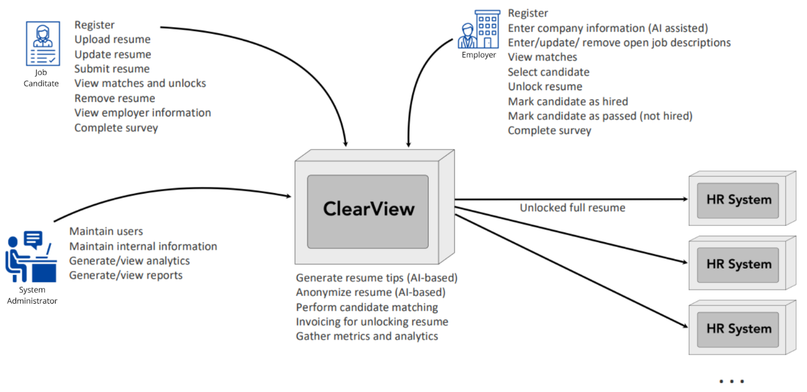
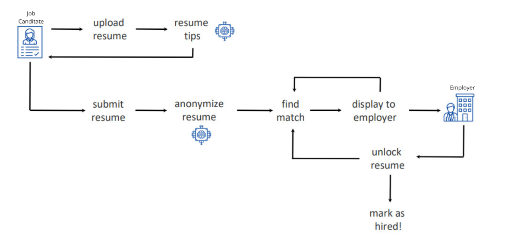

# ClearView Capabilities

With respect to the provided [requirements](/1.Requirements.md), ClearView allows employers to easily post job offerings and view AI curated stories about candidates that are objective and lack personal information in order to reduce bias.

Candidates can use this system to upload their resume, receive AI generated tips on it, and see if there are any job postings that match their skills and experience. The resume then is anonymized using AI and ClearView will be looking for a match in job postings.

When there is a match, recruiters are notified and they have the possibility to unlock the full resume and go forward with the recruiting process.

## Requirement analysis

Get to know how each role will interact with **ClearView** and define User Journeys for [Employers](./UserJourneys/Employer.md), [Candidates](./UserJourneys/JobCandidate.md) and [Admins](./UserJourneys/Admin.md).

## Requirement analysis conclusion

To conclude our requirement analysis, we identified ClearView's [Core Requirements](./CoreRequirements.md#core-requirements) and [Project Constraints](./CoreRequirements.md#project-constraints). Based on these we extract the [Architectural Style](../2.ArchitectureVisualization/ArchitectureStyle.md) and characteristics that are presented in the [C4 Diagram](../2.ArchitectureVisualization/C4Diagram.md).
