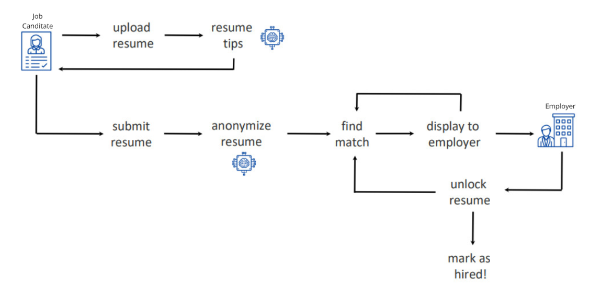

# ClearView Initial Client Requirements :spiral_notepad:

**Diversity Cyber Council** is a Non-Profit that serves under-represented demographics in the tech industry by facilitating education, training, and staffing opportunities to establish a sustainable and diverse talent pipeline to the workforce.

**Diversity Cyber Council**’s goal is to establish a sustainable and diverse talent pipeline that extends **career equity** to underrepresented demographics by providing access to competent training programs that lead to direct employment opportunities.

## Requirements

**ClearView** is a supplemental **HR platform** that anonymizes candidate information while **highlighting objective skills and qualifying experience** to reduce bias in the hiring process. It is not designed to replace current HR systems but to be integrated with them.

One type of input data is the **job posting**. Employers can enter company information and are assisted by AI to do this. Then they can add, update or remove the open job descriptions.

The other important input is the resumes of candidates (via upload) and then leverages AI to construct **stories** about a job candidate based on S.M.A.R.T (Specific, Measurable, Achievable, Relevant, and Time-Bound) goals, qualifications, and experience.
These stories are then quantifiably aligned and matched with open roles posted by companies.

While aligning a candidate with a job description, **ClearView** gathers metrics and analytics, then provides a **Similarity Score**.

**ClearView** must provide AI generated tips for the resume after a candidate uploads it.

All PII (Personal Identifiable Information) and characteristics are eliminated after upload and the anonymized story is stored and given to employers until an objective determination is made on who **the best candidates** are to move forward with. The employer can see the best candidates as a list ordered by similarity score.

When a candidate story satisfies the job description, **ClearView** generates an invoice and the company pays to unlock the profile and data points are aggregated to reveal any disparities between those who are hired and those who were not selected.

Candidates can be marked as Hired or Passed (not hired) by employers.

Candidates are able to view their matches and who unlocked their resume. They are also able to view the employer information and remove their resume if they choose to.

Both Candidates and Employers are able to fill in a survey at the end of the hiring process.

**ClearView** should be integrated with several existing HR systems.

## Main flow for success criteria

The success criteria workflow for ClearView involves anonymizing candidate resumes to eliminate bias, using AI to create S.M.A.R.T. based candidate profiles, and matching these profiles to open job roles with a high similarity score.
Employers then review generated stories and unlock them after making an objective decision. The system provides metrics about current progress and integrates with HR platforms, improving current processes. In the end, success is measured by improved hiring outcomes, reduced bias and a fair, objective hiring process.

## Other considerations

- A trained LLM is already provided for this solution.
- The solution needs to respect AI responsibility principles (**transparency**, **fairness**, **inclusiveness**, privacy and security)
