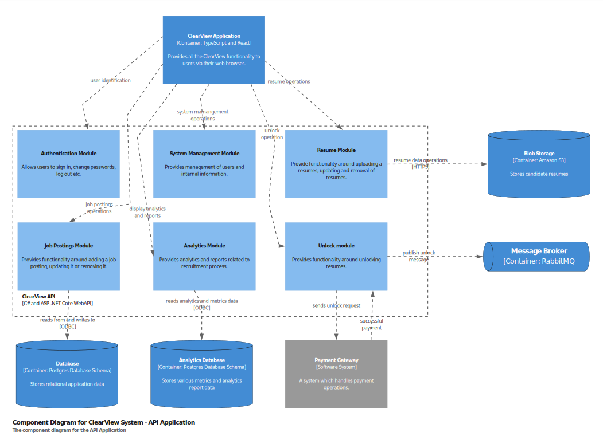

# Context
This diagram provides a high-level overview of the system, highlighting the interactions between ClearView and other systems and roles.

# Containers
By taking a closer look, we can identify the containers of the ClearView system and showcase the technologies involved.

# Components

By going lower into the Container diagram, we can identity the structure of each component, as shown below:

### ClearView API component diagram

---

### ClearView AI component diagram

---

### Resume component diagram

---

### HR integration component diagram

---

### Survey component diagram

---

### Metrics and Analytics component diagram

###
